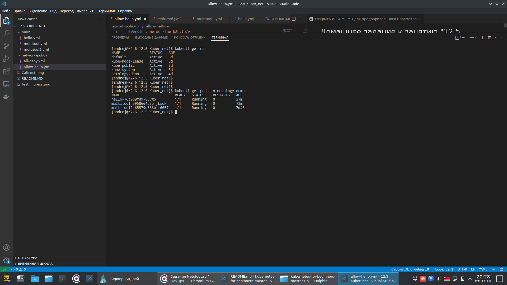
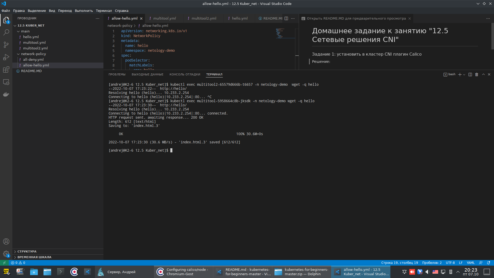
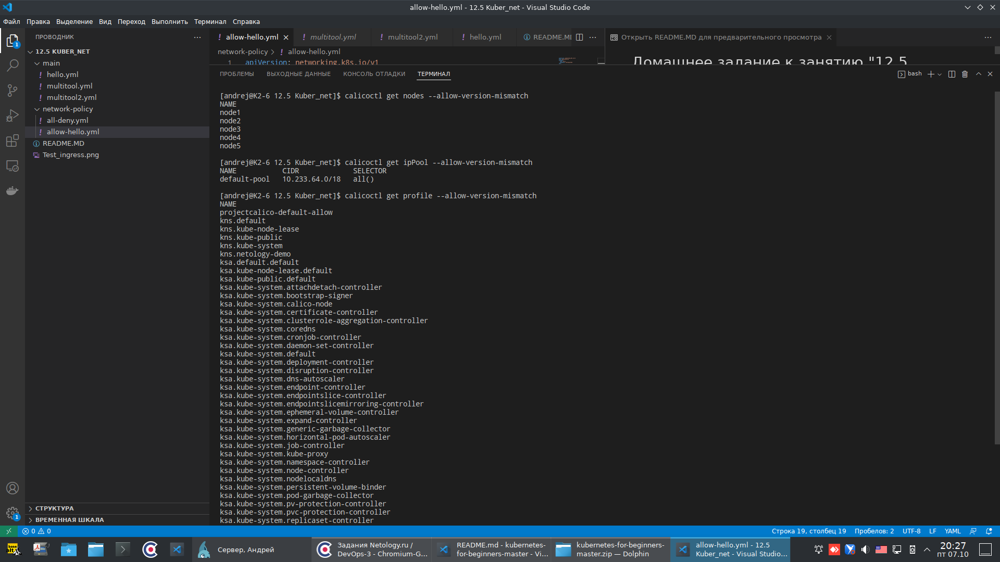

# Домашнее задание к занятию "12.5 Сетевые решения CNI"

### Задание 1: установить в кластер CNI плагин Calico

Решение:
Кластер был установлен в прошлой работе с помощью kubespray.

В нём 5 нод.

Создан namespace `netology-demo`.

С помощью deploymen были созданы 3 пода: nginx-hello (1шт) и multitool (2шт):


Сделаны такие политики:
all-deny.all, чтобы запретить всё, что не разрешено:
```
apiVersion: networking.k8s.io/v1
kind: NetworkPolicy
metadata:
  name: default-deny-ingress
  namespace: netology-demo
spec:
  podSelector: {}
  policyTypes:
    - Ingress
```
и allow-hello.yml, которая разрашает доступ в под hello из пода multitool
```
apiVersion: networking.k8s.io/v1
kind: NetworkPolicy
metadata:
  name: hello
  namespace: netology-demo
spec:
  podSelector:
    matchLabels:
      app: hello
  policyTypes:
    - Ingress
  ingress:
    - from:
      - podSelector:
          matchLabels:
            app: multitool
      ports:
        - protocol: TCP
          port: 80
```

Проверяем:

Здесь видно, что доступа из пода mutitool2 нет, а из multitool есть.

---

### Задание 2: изучить, что запущено по умолчанию

Самый простой способ — проверить командой calicoctl get . Для проверки стоит получить список нод, ipPool и profile. Требования:

установить утилиту calicoctl;
получить 3 вышеописанных типа в консоли.

---

Решение:

Вот такой вывод команды calicoctl *
